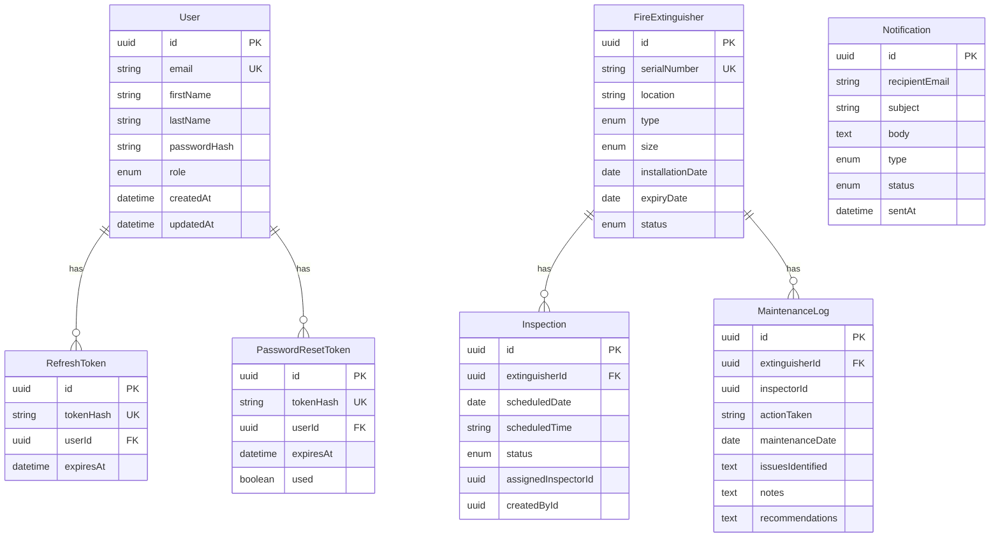

# Entity Relationship Diagram — TZW LTD FEMS

## Overview

Database-per-service architecture on a single PostgreSQL instance:

- **auth_db** — Users, refresh tokens, password reset tokens
- **extinguisher_db** — Fire extinguishers, inspections, maintenance logs
- **notification_db** — Email notification audit log

## ERD

## Indexes

| Table | Index | Purpose |
|-------|-------|---------|
| User | email (unique) | Prevent duplicate registrations |
| User | role | Admin user listing |
| FireExtinguisher | serialNumber (unique) | Prevent duplicate equipment |
| FireExtinguisher | expiryDate, status | Compliance queries |
| Inspection | scheduledDate, status | Report generation |
| MaintenanceLog | maintenanceDate | Maintenance frequency reports |
| Notification | status, type, createdAt | Audit queries |
